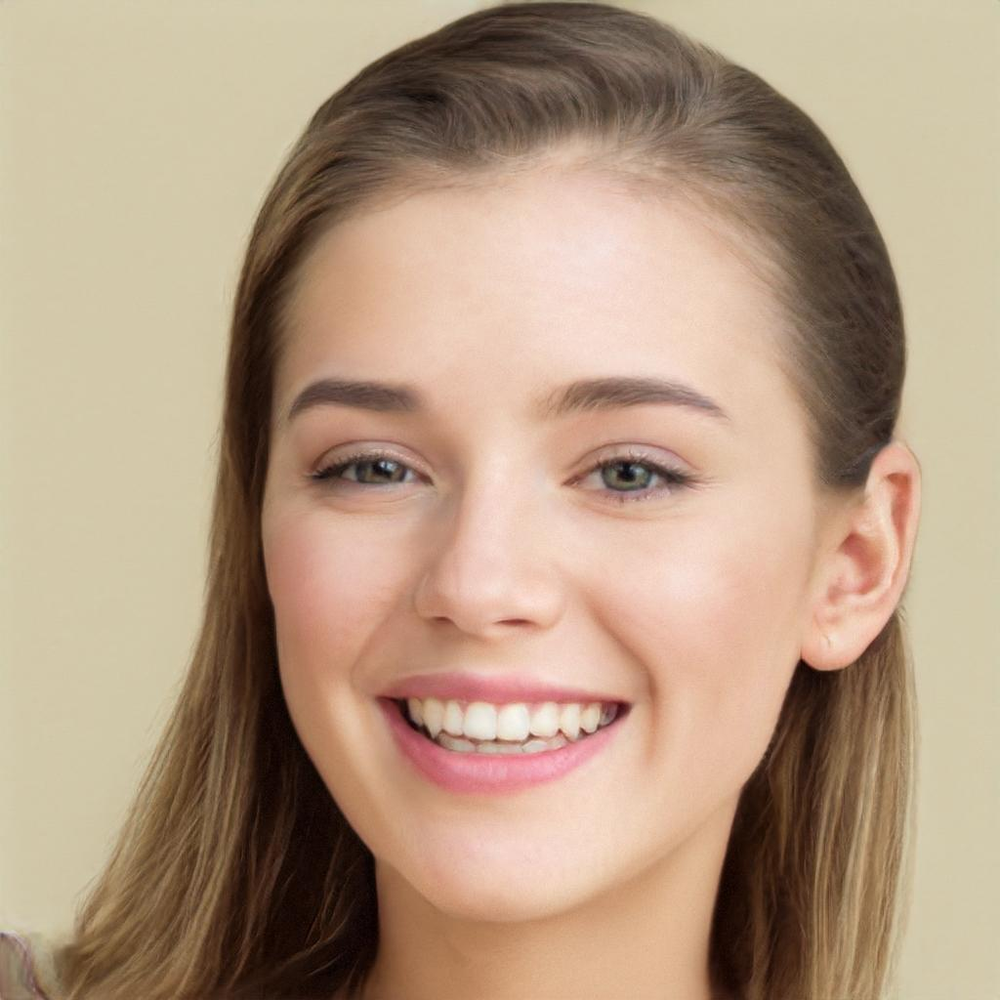

# SVG drawing after Generated Photos

SVG drawing after an AI generated image and animated with CSS opacity change.

## Tools

- Made with [Krita](https://krita.org)
- Reference image from [Generated Photos](https://generated.photos)'s [Instagram post](https://www.instagram.com/p/B29O_TEHQ6j/)

## Process

1. Draw using Line tool.
2. Export as SVG from Vector layer.
3. Optimize via [SVGOMG](https://jakearchibald.github.io/svgomg/). 
4. Animated with CSS.

## Result

## License

This artwork licensed under a [ Creative Commons Attribution 4.0 International license](https://creativecommons.org/licenses/by/4.0/)

